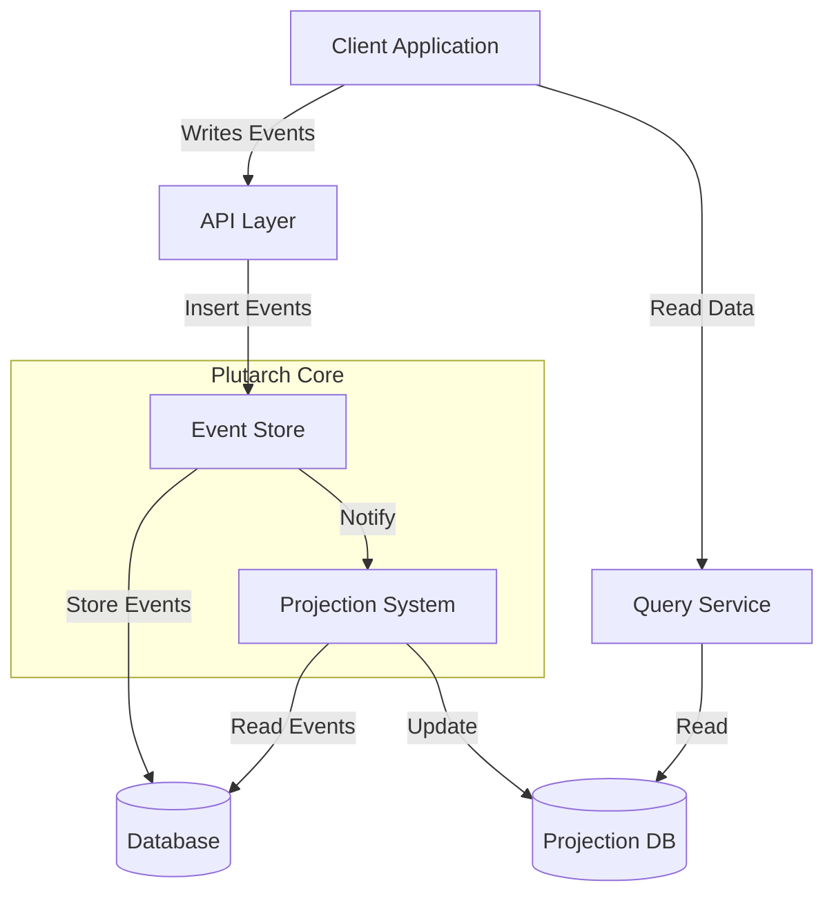

# Plutarch: Type-Safe Event Sourcing System

Plutarch is a robust, type-safe event sourcing system implemented in Haskell. It provides strong guarantees around consistency, versioning, and reliability for building event-driven applications.

## Documentation

Comprehensive documentation is available in the `docs` directory:

- [Documentation Index](docs/index.md) - Start here for all documentation
- [Getting Started Guide](docs/getting-started.md) - Begin your journey with Plutarch
- [Event Core](docs/event-core.md) - Learn about the type-safe event foundation
- [Event Store](docs/event-store.md) - Understanding the storage system
- [Projections](docs/projections.md) - Building read models from events
- [PostgreSQL Details](docs/postgresql-details.md) - Deep dive into the PostgreSQL implementation
- [Testing](docs/testing.md) - How to test event-sourced applications

## System Overview



## Core Features

- **Type-safe event handling** with compile-time guarantees
- **Automatic versioning** of events with seamless migration
- **Multiple storage backends**:
  - In-memory (for testing)
  - Filesystem-based
  - PostgreSQL (production)
- **Strong consistency guarantees**:
  - Write atomicity
  - Causal consistency
  - Stream version integrity
  - Total event ordering
- **Projection system** for building read models
- **OpenTelemetry integration** for observability

## Quick Start

### Prerequisites

- GHC 9.4 or higher
- PostgreSQL (for production use)
- Cabal or Stack build system

### Building and Testing

```bash
# Build the library
cabal build plutarch

# Run tests
cabal run plutarch-test
```

### Basic Example

```haskell
-- Define event type
type UserCreated = 'Event "user_created"

-- Define payload
data UserInfo = UserInfo
  { userName :: Text,
    email :: Text
  } deriving (Show, Eq, Generic, ToJSON, FromJSON)

-- Register with the event system
instance EventVersionInfo UserCreated where
  type MaxVersion UserCreated = 0

instance EventVersionPayloads UserCreated where
  type VersionedPayloads UserCreated = FirstVersion UserInfo

instance UpgradableToLatest UserCreated 0 where
  upgradeToLatest = id

-- Main application logic
main :: IO ()
main = do
  -- Create a store
  store <- newSQLStore connectionString

  -- Generate a stream ID
  streamId <- StreamId <$> UUID.nextRandom

  -- Insert an event
  let userInfo = UserInfo "john.doe" "john@example.com"
      event = SomeLatestEvent (Proxy @UserCreated) userInfo
  
  result <- insertEvents store Nothing $ 
    Map.singleton streamId (StreamEventBatch NoStream [event])

  -- Subscribe to events
  let handler :: EventHandler UserCreated IO SQLStore
      handler event = do
        putStrLn $ "User created: " <> event.payload.userName
        pure Continue

  subscribe store
    (match @UserCreated handler :? MatchEnd)
    EventSelector 
      { streamId = AllStreams
      , startupPosition = FromBeginning
      }
```

## Architecture Decisions

- **Monolithic approach**: The same server handles all aspects:
  - Client dashboard
  - Business dashboard
  - Encoders page
  - Body shop pages
  - Intervention creation
  - ...

- **Backend systems**: Axelor is used for billing, but not as the "source of truth" for business data
  - Requires taking control especially over client files and fleet imports

- **Technology choices**:
  - PostgreSQL database for:
    - Event storage
    - Projections
  - Minimal frontend: server-generated HTML fragments with HTMX

## Contact

For support, contact Gaël Deest at gael.deest@franbec.org .
