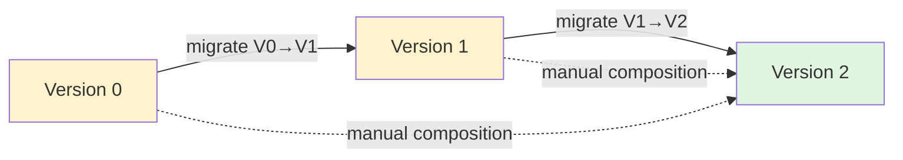
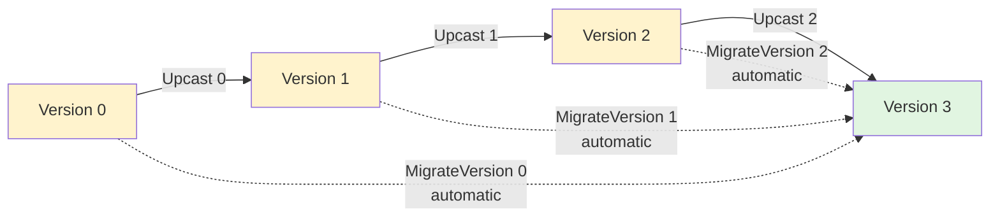
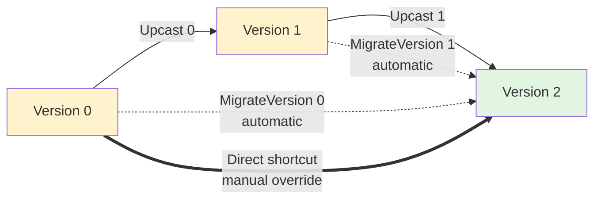

Haskell's code generation features are critically under-appreciated—even by Haskellers themselves. The type system features involved are surely hard to master, but they pay off beautifully: end users write declarative code that is readable, maintainable, and correct by construction.

This blog post demonstrates a concrete application through Hindsight's event versioning system. Even if you're not interested in the library, the technique we use may still be useful to you. Read on!

## Problem Statement

In an event-sourced system, your events are immutable. However, as your application and business knowledge grow, so do your events: you enrich their definition to capture more information and model your business domain more adequately. Your former events using the legacy format are still around, though. Since your business logic is normally defined in terms of the latest event version, you need to be able to convert former versions to the new one when reading them from storage.

The straightforward approach is to write explicit migration functions. One option is to directly migrate each version to the latest one:

```haskell
migrateV0ToV2 :: OrderPlacedV0 -> OrderPlacedV2
migrateV0ToV2 (OrderPlacedV0 oid items) =
    OrderPlacedV2 oid items unknownCustomer epoch

migrateV1ToV2 :: OrderPlacedV1 -> OrderPlacedV2
migrateV1ToV2 (OrderPlacedV1 oid items cid) =
    OrderPlacedV2 oid items cid epoch
```

This works but is quite painful and error-prone. A more manageable approach is to add a granular upcast function from `N-1` to `N` everytime you define a new version. Your migration functions can then be rewritten as the composition of simple upcast functions:

```haskell
migrateV1ToV3 :: OrderPlacedV1 -> OrderPlacedV3
migrateV1ToV3 = migrateV2ToV3 . migrateV1ToV2

migrateV0ToV3 :: OrderPlacedV0 -> OrderPlacedV3
migrateV0ToV3 = migrateV2ToV3 . migrateV1ToV2 . migrateV0ToV1
```

It makes things simpler, but you still need to write / modify `N-1` migration function for each new version.



What if GHC could compose the upcast functions automatically for you? Hindsight uses some type class metaprogramming technique to make this possible. Let's see what it looks like, and then dissect the implementation to understand how it works.

## Automatic Composition: Example

Assume our `"OrderPlaced"` event currently has three versions: `V0`, `V1` and `V2`.

```haskell
{-# LANGUAGE DataKinds #-}
{-# LANGUAGE TypeFamilies #-}

-- Version 0: Initial event
data OrderPlacedV0 = OrderPlacedV0
    { orderId :: Text
    , items :: [Item]
    } deriving (Show, Eq, Generic, ToJSON, FromJSON)

-- Version 1: Add customer tracking
data OrderPlacedV1 = OrderPlacedV1
    { orderId :: Text
    , items :: [Item]
    , customerId :: CustomerId
    } deriving (Show, Eq, Generic, ToJSON, FromJSON)

-- Version 2: Add timestamp
data OrderPlacedV2 = OrderPlacedV2
    { orderId :: Text
    , items :: [Item]
    , customerId :: CustomerId
    , placedAt :: UTCTime
    } deriving (Show, Eq, Generic, ToJSON, FromJSON)
```

In Hindsight, users only need to define consecutive upgrades. Everything else is declarative. Here is what it looks like:

```haskell
-- Declare the version metadata
type instance MaxVersion "OrderPlaced" = 2
type instance Versions "OrderPlaced" =
    '[OrderPlacedV0, OrderPlacedV1, OrderPlacedV2]

-- Define only the consecutive transitions
instance Upcast 0 "OrderPlaced" where
    upcast (OrderPlacedV0 oid items) =
        OrderPlacedV1 oid items unknownCustomer

instance Upcast 1 "OrderPlaced" where
    upcast (OrderPlacedV1 oid items cid) =
        OrderPlacedV2 oid items cid epoch

-- Empty instances - automatic composition
instance MigrateVersion 0 "OrderPlaced"
instance MigrateVersion 1 "OrderPlaced"
instance MigrateVersion 2 "OrderPlaced"

instance Event "OrderPlaced"
```

When you add V3, you need to:

```haskell
{- 1. Define the new payload -}
data OrderPlacedV3 = OrderPlacedV3 { ... }

{- 2. Bump the version counter -}
type instance MaxVersion "OrderPlaced" = 3

{- 3. Upgrade the payload vector -}
type instance Versions "OrderPlaced" =
    '[OrderPlacedV0, OrderPlacedV1, OrderPlacedV2, OrderPlacedV3]

{- 4. Write the upcast logic for version N-1 -}
instance Upcast 2 "OrderPlaced" where
    upcast (OrderPlacedV2 oid items cid placedAt) = ...

{- 5. Register the version to the migration system -}
instance MigrateVersion 3 "OrderPlaced"
```

The V0→V3, V1→V3, and V2→V3 migrations compose automatically from the consecutive upgrades. You don't write any composition code yourself.



## How It Works: Default Implementations and Dispatch

Hindsight's user-facing API is made of two type classes:

```haskell
-- Single consecutive upgrade step
class Upcast (ver :: Nat) (event :: Symbol) where
    upcast ::
        PayloadAtVersion ver (EventVersionVector event) ->
        PayloadAtVersion (ver + 1) (EventVersionVector event)

-- Migration to latest version
class MigrateVersion (ver :: Nat) (event :: Symbol) where
    migrateVersion ::
        PayloadAtVersion ver (EventVersionVector event) ->
        CurrentPayloadType event

    -- Default: compose via consecutive upcasts
    default migrateVersion ::
        (ConsecutiveUpcast (IsLatest (ToPeanoNat ver) event) (ToPeanoNat ver) event) =>
        PayloadAtVersion (ToPeanoNat ver) (EventVersionVector event) ->
        CurrentPayloadType event
    migrateVersion = viaConsecutive @(IsLatest (ToPeanoNat ver) event)
```

`Upcast` instances are user-defined and application-specific. All the magic happens in the `MigrateVersion` type class, specifically in the **default** implementation of the `migrateVersion` method.

The type signature is complex because we need to handle two cases:

- At latest version: return identity (no migration needed)
- Before latest: compose consecutive upcasts recursively

However, we can't write both behaviors directly in `MigrateVersion`'s default implementation. Type class methods allow only one default. The solution is to delegate to a helper class `ConsecutiveUpcast` that dispatches on a type-level `Bool`:

- When the `Bool` is `'True` (at latest): one instance provides identity
- When the `Bool` is `'False` (before latest): another instance provides composition

```haskell
type family IsLatest (ver :: PeanoNat) (event :: Symbol) :: Bool where
    IsLatest ver event = PeanoEqual ver (MaxVersionPeano event)

class ConsecutiveUpcast (isLatest :: Bool) (ver :: PeanoNat) (event :: Symbol) where
    viaConsecutive ::
        PayloadAtVersion ver (EventVersionVector event) ->
        CurrentPayloadType event
```

The type class instances then pattern-match on the `Bool` parameter to provide the desired behavior.
When `isLatest` is `'True`, we're at the latest version—return identity:

```haskell
instance
    ( ver ~ MaxVersionPeano event
    , PayloadAtVersion ver (EventVersionVector event) ~ CurrentPayloadType event
    ) => ConsecutiveUpcast 'True ver event where
    viaConsecutive = id
```

When `isLatest` is `'False`, we're not at latest—upcast one step, then recurse. The recursion uses Peano numbers (`PeanoZero`, `PeanoSucc n`) because they support structural pattern matching at the type level, unlike GHC's built-in `Nat` which relies on type families:

```haskell
instance
    ( Upcast (FromPeanoNat ver) event
    , ConsecutiveUpcast (IsLatest ('PeanoSucc ver) event) ('PeanoSucc ver) event
    , -- Additional constraints for type equality...
    ) => ConsecutiveUpcast 'False ver event where
    viaConsecutive =
        viaConsecutive @(IsLatest ('PeanoSucc ver) event) @('PeanoSucc ver)
            . upcast @(FromPeanoNat ver)
```

The recursion bottoms out when `IsLatest` returns `'True` at the max version.

### Peano Numbers

As mentioned above, Hindsight uses Peano numbers for type-level recursion:

```haskell
data PeanoNat where
    PeanoZero :: PeanoNat
    PeanoSucc :: PeanoNat -> PeanoNat
```

This inductive definition enables structural recursion at the type level—we can pattern match on the structure. GHC's built-in `Nat` kind doesn't support this; it relies on closed type families. The `ToPeanoNat` and `FromPeanoNat` type families convert between `Nat` and `PeanoNat`, keeping the user-facing API in terms of `Nat` while using `PeanoNat` internally.

## Manual Overrides

The default composition works for most cases, but you can override when needed. Common reasons:

**Performance**: Migrating millions of V0 events through intermediate versions is slower than a direct upgrade.

**Domain optimization**: You have semantic knowledge that makes a direct path simpler or more correct.

```haskell
-- Override the default
instance MigrateVersion 0 "OrderPlaced" where
    migrateVersion (OrderPlacedV0 oid items) =
        -- Direct V0→V2, compute customer from items
        OrderPlacedV2 oid items (parseCustomerFromItems items) epoch
```

The type system still ensures you return the correct latest version type, and your implementation takes precedence over the default one.



## Conclusion

The approach uses default implementations productively: defaults for the common case, explicit overrides for optimization. Indirection to another type class with an additional typelevel parameter (provided by a custom type family) allows us to customize the default implementation based on the context. The type-level machinery enables structural recursion that composes correctly by construction.

The complete implementation lives in `Hindsight.Events`.

- [Hindsight.Events source](https://github.com/hindsight-es/hindsight/blob/c1721b9295168be31a74f3876f07633a84f1a73f/hindsight-core/src/Hindsight/Events.hs) - Implementation (GitHub permalink)

You might also want to read our tutorial on event versioning:

- [Tutorial 04: Event Versioning](/docs/tutorials/04-event-versioning.html) - Full walkthrough

Happy hacking!
